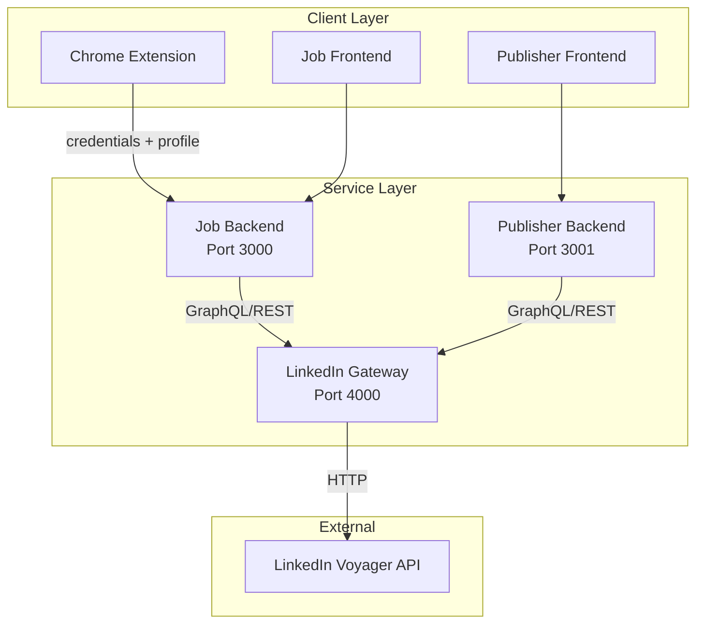

# LinkedIn Toolchain

A full-stack monorepo that automates LinkedIn workflows — from job searching and application submission to profile management and content publishing. Built with a service-oriented architecture where each package handles a specific domain.

---

## Architecture Overview

---

## Services

<Cards>
  <Card title="LinkedIn Gateway" href="/docs/gateway/overview">
    REST + GraphQL proxy to LinkedIn Voyager APIs. Handles job search, post publishing, and profile parsing.
  </Card>
  <Card title="Job Backend" href="/docs/job-backend/overview">
    Orchestrates job applications with AI-powered form filling, resume optimization, and application tracking.
  </Card>
  <Card title="Publisher Backend" href="/docs/publisher-backend/overview">
    Content creation platform with AI post generation, carousel PDF rendering, and scheduled publishing.
  </Card>
  <Card title="Chrome Extension" href="/docs/extension">
    Browser extension that syncs LinkedIn session cookies and profile data to the backend.
  </Card>
  <Card title="Shared Package" href="/docs/shared">
    TypeScript types and React UI components shared across all frontends and backends.
  </Card>
</Cards>

---

## Tech Stack

| Layer | Technology |
| :--- | :--- |
| **Gateway** | Express + Apollo Server (GraphQL) + Swagger |
| **Backends** | Express + Prisma + SQLite |
| **AI Integration** | Google Gemini / Claude via OpenAI-compatible API |
| **PDF Generation** | Puppeteer + PDFKit |
| **Frontends** | React + Vite + Zustand |
| **Build** | Turborepo + pnpm workspaces |

---

## Explore

<Cards>
  <Card title="Quick Start" href="/docs/quickstart">
    Get up and running with authentication and your first API call.
  </Card>
  <Card title="Architecture" href="/docs/architecture">
    Deep dive into the dual REST/GraphQL gateway design.
  </Card>
  <Card title="Security" href="/docs/security">
    Credential validation, log sanitization, and CSRF protection.
  </Card>
</Cards>
