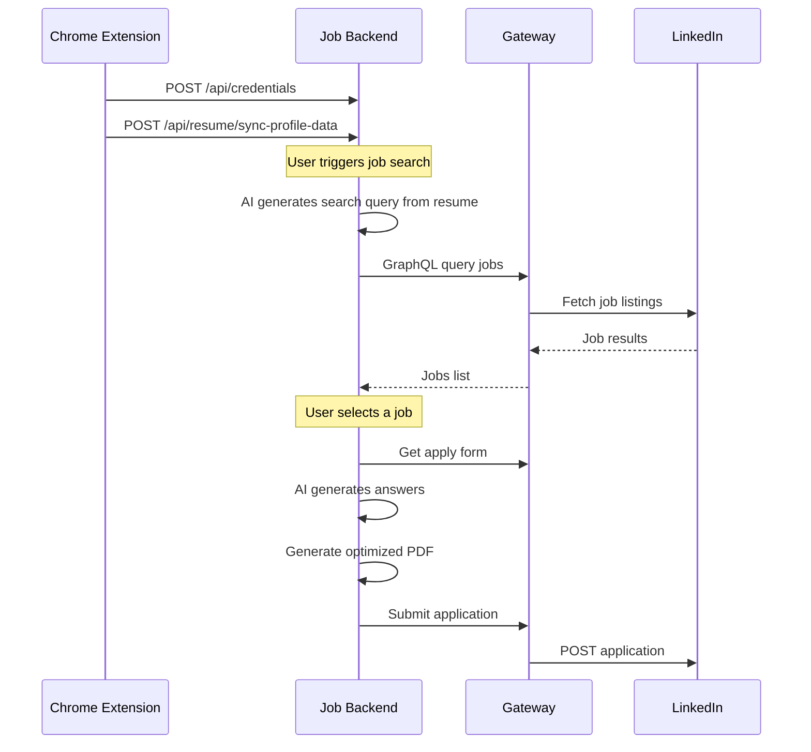

# Job Backend

The **Job Backend** (`packages/job-backend`) is the core orchestrator for job search and application automation. It manages the full lifecycle: from searching jobs and generating AI-powered answers to tracking application statuses.

---

## What It Does

- **Smart Job Search**: Auto-generates search queries from your resume using AI
- **AI Form Filling**: Generates contextual answers for Easy Apply questionnaires using Gemini/Claude
- **Resume Optimization**: Tailors resume content per job description and generates optimized PDFs
- **Application Tracking**: Stores all applications locally and syncs status with LinkedIn
- **Credential Management**: Receives and stores session cookies from the Chrome Extension

---

## Service Flow



---

## API Sections

<Cards>
  <Card title="Session Management" href="/docs/job-backend/credentials/getCredentialsStatus">
    Check and sync LinkedIn session cookies from the Chrome extension.
  </Card>
  <Card title="Resume & Profile" href="/docs/job-backend/resume/importProfilePdfFromLinkedin">
    Import, parse, and manage candidate resume data.
  </Card>
  <Card title="AI Answer Generation" href="/docs/job-backend/ai/generateQuestionnaireAnswers">
    Auto-fill application questions using LLM integration.
  </Card>
  <Card title="Application Tracking" href="/docs/job-backend/applications/listJobApplications">
    List, sync, and download tailored resumes for applications.
  </Card>
</Cards>

---

## Environment Variables

```bash
# LLM Integration
NINE_ROUTER_API_KEY=your_api_key
NINE_ROUTER_BASE_URL=http://localhost:20128/v1
NINE_ROUTER_MODEL=kr/claude-sonnet-4.5

# Gateway Connection
LINKEDIN_SERVICE_URL=http://localhost:4000/graphql

# Server Port
PORT=3000
```

---

## Tech Stack

| Component | Technology |
| :--- | :--- |
| Framework | Express (Node.js, TypeScript) |
| Database | Prisma + SQLite (`better-sqlite3`) |
| LLM | Google Gemini / Claude via OpenAI-compatible API |
| PDF | Puppeteer (headless Chrome) |
| Gateway Client | GraphQL over HTTP |

---

## Related

- [LinkedIn Gateway](/docs/gateway/overview) — the Gateway service this backend consumes
- [Publisher Backend](/docs/publisher-backend/overview) — sibling service for content publishing
