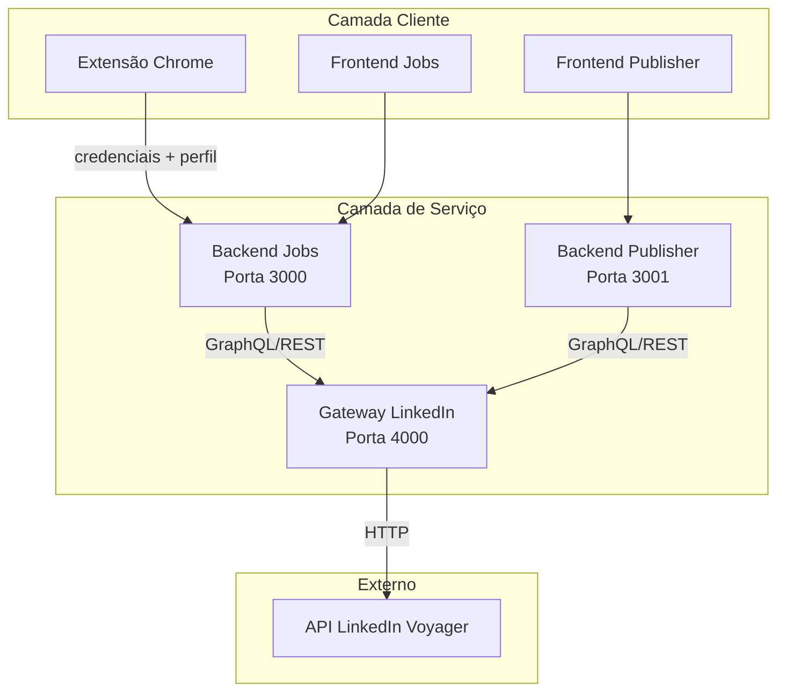

# Ferramentas LinkedIn

Um monorepo full-stack que automatiza fluxos de trabalho do LinkedIn — desde busca de vagas e envio de candidaturas até gestão de perfil e publicação de conteúdo. Construído com arquitetura orientada a serviços onde cada pacote gerencia um domínio específico.

---

## Visão Geral da Arquitetura

---

## Serviços

<Cards>
  <Card title="Gateway LinkedIn" href="/docs/gateway/overview">
    Proxy REST + GraphQL para APIs LinkedIn Voyager. Gerencia busca de vagas, publicação de posts e análise de perfis.
  </Card>
  <Card title="Backend Jobs" href="/docs/job-backend/overview">
    Orquestra candidaturas com preenchimento de formulários via IA, otimização de currículo e rastreamento de aplicações.
  </Card>
  <Card title="Backend Publisher" href="/docs/publisher-backend/overview">
    Plataforma de criação de conteúdo com geração de posts via IA, renderização de PDFs de carrossel e publicação agendada.
  </Card>
  <Card title="Extensão Chrome" href="/docs/extension">
    Extensão de navegador que sincroniza cookies de sessão do LinkedIn e dados de perfil com o backend.
  </Card>
  <Card title="Pacote Compartilhado" href="/docs/shared">
    Tipos TypeScript e componentes UI React compartilhados entre todos os frontends e backends.
  </Card>
</Cards>

---

## Stack Tecnológico

| Camada | Tecnologia |
| :--- | :--- |
| **Gateway** | Express + Apollo Server (GraphQL) + Swagger |
| **Backends** | Express + Prisma + SQLite |
| **Integração IA** | Google Gemini / Claude via API compatível com OpenAI |
| **Geração PDF** | Puppeteer + PDFKit |
| **Frontends** | React + Vite + Zustand |
| **Build** | Turborepo + pnpm workspaces |

---

## Explorar

<Cards>
  <Card title="Início Rápido" href="/docs/quickstart">
    Configure e execute sua primeira chamada de API com autenticação.
  </Card>
  <Card title="Arquitetura" href="/docs/architecture">
    Mergulhe no design do gateway dual REST/GraphQL.
  </Card>
  <Card title="Segurança" href="/docs/security">
    Validação de credenciais, sanitização de logs e proteção CSRF.
  </Card>
</Cards>
