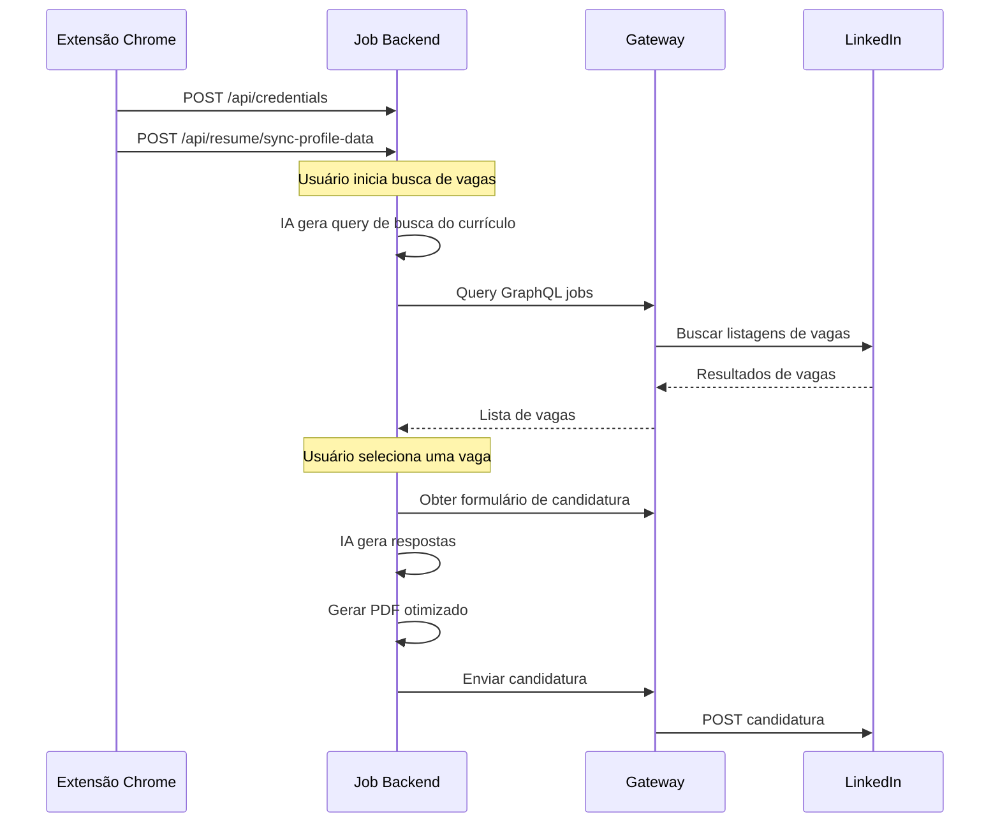

# Job Backend

O **Job Backend** (`packages/job-backend`) é o orquestrador central para busca de vagas e automação de candidaturas. Gerencia o ciclo completo: desde buscar vagas e gerar respostas com IA até rastrear status de candidaturas.

---

## O Que Faz

- **Busca Inteligente de Vagas**: Gera automaticamente queries de busca a partir do seu currículo usando IA
- **Preenchimento de Formulários com IA**: Gera respostas contextuais para questionários Easy Apply usando Gemini/Claude
- **Otimização de Currículo**: Adapta conteúdo do currículo por descrição de vaga e gera PDFs otimizados
- **Rastreamento de Candidaturas**: Armazena todas as candidaturas localmente e sincroniza status com LinkedIn
- **Gestão de Credenciais**: Recebe e armazena cookies de sessão da Extensão Chrome

---

## Fluxo de Serviço



---

## Seções da API

<Cards>
  <Card title="Gestão de Sessão" href="/docs/job-backend/credentials/getCredentialsStatus">
    Verificar e sincronizar cookies de sessão LinkedIn da extensão Chrome.
  </Card>
  <Card title="Currículo & Perfil" href="/docs/job-backend/resume/importProfilePdfFromLinkedin">
    Importar, analisar e gerenciar dados de currículo do candidato.
  </Card>
  <Card title="Geração de Respostas IA" href="/docs/job-backend/ai/generateQuestionnaireAnswers">
    Preencher automaticamente perguntas de candidatura usando integração LLM.
  </Card>
  <Card title="Rastreamento de Candidaturas" href="/docs/job-backend/applications/listJobApplications">
    Listar, sincronizar e baixar currículos personalizados para candidaturas.
  </Card>
</Cards>

---

## Variáveis de Ambiente

```bash
# Integração LLM
NINE_ROUTER_API_KEY=sua_chave_api
NINE_ROUTER_BASE_URL=http://localhost:20128/v1
NINE_ROUTER_MODEL=kr/claude-sonnet-4.5

# Conexão Gateway
LINKEDIN_SERVICE_URL=http://localhost:4000/graphql

# Porta do Servidor
PORT=3000
```

---

## Stack Tecnológico

| Componente | Tecnologia |
| :--- | :--- |
| Framework | Express (Node.js, TypeScript) |
| Banco de Dados | Prisma + SQLite (`better-sqlite3`) |
| LLM | Google Gemini / Claude via API compatível OpenAI |
| PDF | Puppeteer (Chrome headless) |
| Cliente Gateway | GraphQL sobre HTTP |

---

## Relacionado

- [LinkedIn Gateway](/docs/gateway/overview) — o serviço Gateway que este backend consome
- [Publisher Backend](/docs/publisher-backend/overview) — serviço irmão para publicação de conteúdo
