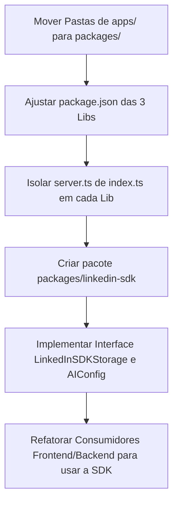

# Plano de Migração: Ecossistema de Bibliotecas e SDK Única do LinkedIn

Este documento apresenta o plano detalhado para transformar os três serviços de backend do ecossistema LinkedIn do monorepo em pacotes (libraries) de workspace do `pnpm`, culminando na criação de uma **SDK única unificada, agnóstica de banco de dados e compatível com o protocolo aberto da OpenAI (`@linkedin-job-applier/linkedin-sdk`)**.

---

## 🎯 Objetivos do Ecossistema Desacoplado

1. **Desacoplamento Completo de Armazenamento**: O SDK não possui dependência direta de banco de dados (SQLite/Prisma). Em vez disso, expõe a interface `LinkedInSDKStorage` permitindo que o usuário armazene seus dados onde quiser (PostgreSQL, MySQL, Drizzle, etc.).
2. **Independência de LLM (OpenAI-Compatible)**: O SDK utiliza chamadas ao protocolo aberto `/v1/chat/completions`, permitindo se conectar a qualquer LLM que suporte o padrão (OpenAI oficial, Ollama local com LLaMA/DeepSeek, OpenRouter, LM Studio).
3. **Consumo Híbrido (Direct vs. HTTP)**:
   - **Direct Mode**: Execução in-process direta (ideal para Lambda Workers, BullMQ, e CRONs) sem latência de rede, importando serviços que acessam a abstração de banco fornecida pelo usuário.
   - **HTTP Mode**: Consumo via cliente HTTP encapsulado (ideal para React/Next.js e clientes externos) fazendo chamadas de API tipadas para os gateways.
4. **Isolamento de Bibliotecas Externas**: Exclusão de qualquer acoplamento de bibliotecas externas específicas (como geradores locais de PDFs ou renderizadores específicos) que não estejam atrelados à comunicação do LinkedIn Voyager GraphQL Gateway.

---

## 🏗️ Estrutura de Diretórios Proposta

Moveremos os microsserviços de `apps/` para `packages/`, organizando o monorepo de forma que as aplicações remanescentes em `apps/` sejam apenas consumidores finais (ex: frontend, docs).

```text
linkedin-job-explorer/
├── apps/
│   ├── docs/                          <-- Landing page e documentação
│   ├── linkedin-job-frontend/         <-- Frontend de vagas
│   └── linkedin-publisher-frontend/    <-- Frontend do publicador de posts
├── packages/
│   ├── shared/                        <-- Design System e componentes React
│   ├── graphql-linkedin/              <-- Lógica GraphQL e resolvers do LinkedIn (Voyager Gateway)
│   ├── job-backend/                   <-- Serviços centrais de vagas (Resume, AI, Apply)
│   ├── publisher-backend/             <-- Serviços centrais do publicador (Carousel, Post)
│   └── linkedin-sdk/                  <-- NOVA: Fachada unificada desacoplada
```

---

## 🛠️ Passo a Passo da Migração



### 1. Reorganização Física das Pastas
Execute as seguintes movimentações usando o terminal:
```bash
mv apps/graphql-linkedin packages/graphql-linkedin
mv apps/linkedin-job-backend packages/job-backend
mv apps/linkedin-publisher-backend packages/publisher-backend
```

---

### 2. Interface do Adaptador de Armazenamento (`src/types.ts`)

A SDK define e consome o adaptador abaixo, deixando a critério do desenvolvedor a implementação da persistência (SQL, NoSQL, in-memory):

```typescript
export interface LinkedInSDKStorage {
  getResume(profileId: string): Promise<Resume | null>;
  getLatestResume(): Promise<Resume | null>;
  upsertResume(profileId: string | null, data: Partial<Resume>): Promise<Resume>;
  
  saveApplication(
    jobId: string,
    answers: string,
    status: string,
    metadata?: ApplicationMetadata
  ): Promise<Application>;
  listApplications(): Promise<Application[]>;
  getApplicationByJobId(jobId: string): Promise<Application | null>;
  updateApplicationStatus(jobId: string, status: string): Promise<Application | null>;
}
```

---

### 3. Classe Principal da SDK Unificada (`packages/linkedin-sdk/src/index.ts`)

```typescript
import { JobsNamespace } from './namespaces/jobs.namespace';
import { PublisherNamespace } from './namespaces/publisher.namespace';
import { GraphQLNamespace } from './namespaces/graphql.namespace';
import type { LinkedInSDKStorage, AIConfig } from './types';

export interface LinkedInSDKConfig {
  mode: 'direct' | 'http';
  baseUrl?: string;               // Obrigatório para modo 'http'
  linkedinCredentials?: {
    cookie: string;
    csrf: string;
  };
  ai?: AIConfig;                  // Configuração OpenAI-compatible
  storage?: LinkedInSDKStorage;   // Adaptador de banco de dados (Obrigatório em direct mode)
}

export class LinkedInSDK {
  public jobs: JobsNamespace;
  public publisher: PublisherNamespace;
  public graphql: GraphQLNamespace;

  constructor(config: LinkedInSDKConfig) {
    if (config.mode === 'http' && !config.baseUrl) {
      throw new Error("O parâmetro 'baseUrl' é obrigatório no modo HTTP.");
    }
    if (config.mode === 'direct' && !config.storage) {
      throw new Error("Um storage adapter ('storage') é obrigatório no modo direct.");
    }
    
    this.jobs = new JobsNamespace(config);
    this.publisher = new PublisherNamespace(config);
    this.graphql = new GraphQLNamespace(config);
  }
}
```

---

### 4. Chamadas de IA no Padrão Aberto OpenAI (`src/namespaces/jobs.namespace.ts`)

Lógica de geração de respostas utilizando o endpoint aberto da OpenAI:

```typescript
import axios from 'axios';
import type { LinkedInSDKConfig } from '../index';
import type { FormQuestion, AIResponse } from '../types';

export class JobsNamespace {
  constructor(private config: LinkedInSDKConfig) {}

  async generateAnswers(questions: FormQuestion[], resumeText: string): Promise<AIResponse> {
    if (!this.config.ai) {
      throw new Error("Opções de IA não configuradas.");
    }

    const { baseUrl, apiKey, model } = this.config.ai;
    const prompt = `Gere as melhores respostas com base no currículo: ${resumeText}. Perguntas: ${JSON.stringify(questions)}`;

    const { data } = await axios.post(
      `${baseUrl}/chat/completions`,
      {
        model,
        messages: [{ role: 'user', content: prompt }],
        response_format: { type: 'json_object' }
      },
      {
        headers: {
          'Content-Type': 'application/json',
          ...(apiKey ? { Authorization: `Bearer ${apiKey}` } : {})
        }
      }
    );

    return JSON.parse(data.choices[0].message.content) as AIResponse;
  }
}
```

---

## ✅ Lista de Tarefas para Execução Autônoma

- [x] **Criar Documentos de Especificação**: Criar especificações detalhadas do SDK agnóstico.
- [ ] **Mapeamento de Dependências**: Validar as assinaturas e tipos comuns no pacote `@linkedin-job-applier/shared`.
- [ ] **Mudança Física**: Executar a migração das pastas do monorepo de `apps/` para `packages/`.
- [ ] **Desacoplamento de Banco**: Remover imports do Prisma de dentro da lógica core do SDK e convertê-los para usar a interface `LinkedInSDKStorage`.
- [ ] **Atualização da IA**: Refatorar o `aiService` para realizar requisições no padrão da OpenAI utilizando o `aiConfig` injetado.
- [ ] **Link de Workspace**: Rodar `pnpm install` para atualizar as dependências internas do monorepo.
- [ ] **Validação com Turbo**: Validar o build de todo o monorepo via `pnpm build`.
- [ ] **Criação do Pull Request**: Utilizar a CLI do GitHub (`gh pr create`) para abrir a Pull Request.
